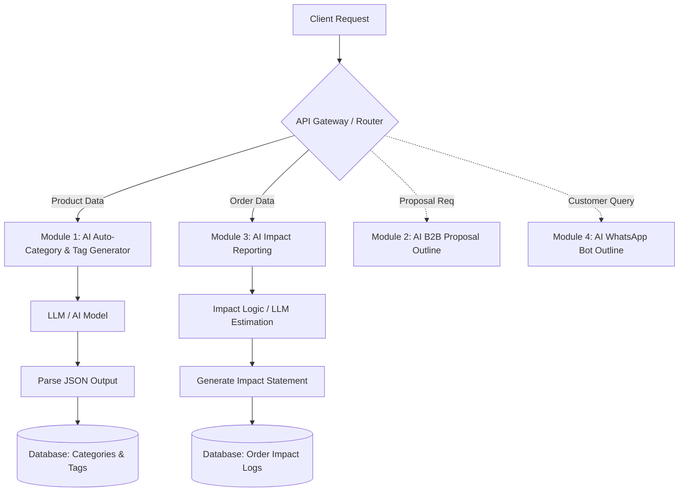

# Rayeva – AI Systems Assignment

## Role: Full Stack / AI Intern
Focus: Applied AI for Sustainable Commerce

---

## Project Architecture & Workflow Diagram

## Project Milestones

### Milestone 1: Project Setup & Core Configuration
- Initialize GitHub Repository.
- Setup environment variables .env (API Keys, DB URIs).
- Choose tech stack (e.g., Python FastAPI or Node.js).
- Implement basic project modular structure and error handling.

### Milestone 2: Module 1 Implementation (AI Auto-Category & Tag Generator)
- Create AI prompts for categorizing sustainable products.
- Setup structured output parsing (JSON).
- Build the endpoint to take product descriptions and return tags, categories, and sustainability filters.
- Connect and save structured output to the Database.

### Milestone 3: Module 3 Implementation (AI Impact Reporting Generator)
- Design prompts/logic for plastic saved & carbon avoided estimations.
- Develop generation of human-readable impact statements.
- Build API endpoint to process order data and store impact summaries.

### Milestone 4: Architecture Outline for Modules 2 & 4
- Document system diagrams for the B2B Proposal Generator.
- Document high-level flow for the WhatsApp Support Bot.

### Milestone 5: Testing, Refinement & Delivery
- Standardize error handling and prompt/response logging.
- Verify separation of AI and business logic.
- Record the 3-5 minute demo video.
- Final code polish and deployment readiness.

## Required Capabilities
- Structured JSON Outputs from AI
- Environment-based API key management
- Clean separation of AI and Business Logic

## AI Prompt Design Explanation

Our application uses a **Hybrid Prompting Strategy**, ensuring that AI works hand-in-hand with strict Business Logic instead of guessing numerical or sensitive values:
1. **System Directives:** Every LLM call begins with a strict role (e.g., "You are a Sustainability Impact Reporter"). We enforce `response_format={"type": "json_object"}` to guarantee exact output structure.
2. **Contextual Grounding:** For Module 3, the AI does *not* calculate metrics. The Business Logic does the exact math (e.g., `15g * quantity`). We then inject these calculated variables into the AI prompt. The AI only focuses on what it is best at: generating a creative "Impact Statement".
3. **Structured Validation:** Pydantic models intercept every AI JSON output, eliminating hallucinations and dirty data before it reaches any database simulator.

## Remaining Architecture Outlines

### Module 2: AI B2B Proposal Generator
- **Flow:** The client specifies a budget limit and sustainability preference.
- **Business Logic Layer:** The system pre-fetches products, algorithmically building a mix that fits strictly under the budget limit and calculates cost breakdowns.
- **AI Layer:** The LLM receives the hard-coded budget output and generates an 'Impact Positioning Summary' to help the client understand their ESG (Environmental, Social, & Governance) impact.
- **Output:** A strict JSON payload holding financial arrays (from code) and positioning text (from AI).

### Module 4: AI WhatsApp Support Bot
- **Flow:** Customer text reaches API via Webhook (e.g., Twilio).
- **Business Logic Layer:** System looks up tracking/return data purely from the Database.
- **AI Layer:** 
  - It creates a polite, natural response injecting the DB tracking data.
  - An underlying Intent Classifier analyzes the user's emotion. If intent is `refund` or `angry`, it flags `ESCALATE` and pauses automated replies.
- **Output:** Fully logged AI vs Human conversation threads in the database.