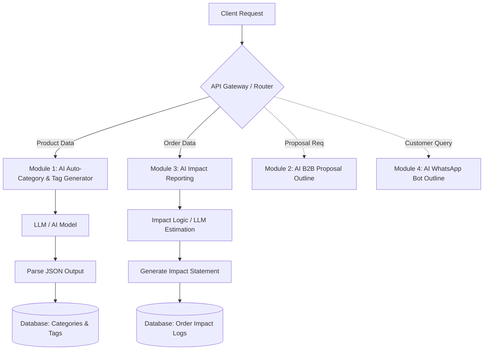

# Rayeva – AI Systems Assignment

## Role: Full Stack / AI Intern
Focus: Applied AI for Sustainable Commerce

---

## Project Architecture & Workflow Diagram

## Project Milestones

### Milestone 1: Project Setup & Core Configuration
- Initialize GitHub Repository.
- Setup environment variables .env (API Keys, DB URIs).
- Choose tech stack (e.g., Python FastAPI or Node.js).
- Implement basic project modular structure and error handling.

### Milestone 2: Module 1 Implementation (AI Auto-Category & Tag Generator)
- Create AI prompts for categorizing sustainable products.
- Setup structured output parsing (JSON).
- Build the endpoint to take product descriptions and return tags, categories, and sustainability filters.
- Connect and save structured output to the Database.

### Milestone 3: Module 3 Implementation (AI Impact Reporting Generator)
- Design prompts/logic for plastic saved & carbon avoided estimations.
- Develop generation of human-readable impact statements.
- Build API endpoint to process order data and store impact summaries.

### Milestone 4: Architecture Outline for Modules 2 & 4
- Document system diagrams for the B2B Proposal Generator.
- Document high-level flow for the WhatsApp Support Bot.

### Milestone 5: Testing, Refinement & Delivery
- Standardize error handling and prompt/response logging.
- Verify separation of AI and business logic.
- Record the 3-5 minute demo video.
- Final code polish and deployment readiness.

## Required Capabilities
- Structured JSON Outputs from AI
- Environment-based API key management
- Clean separation of AI and Business Logic