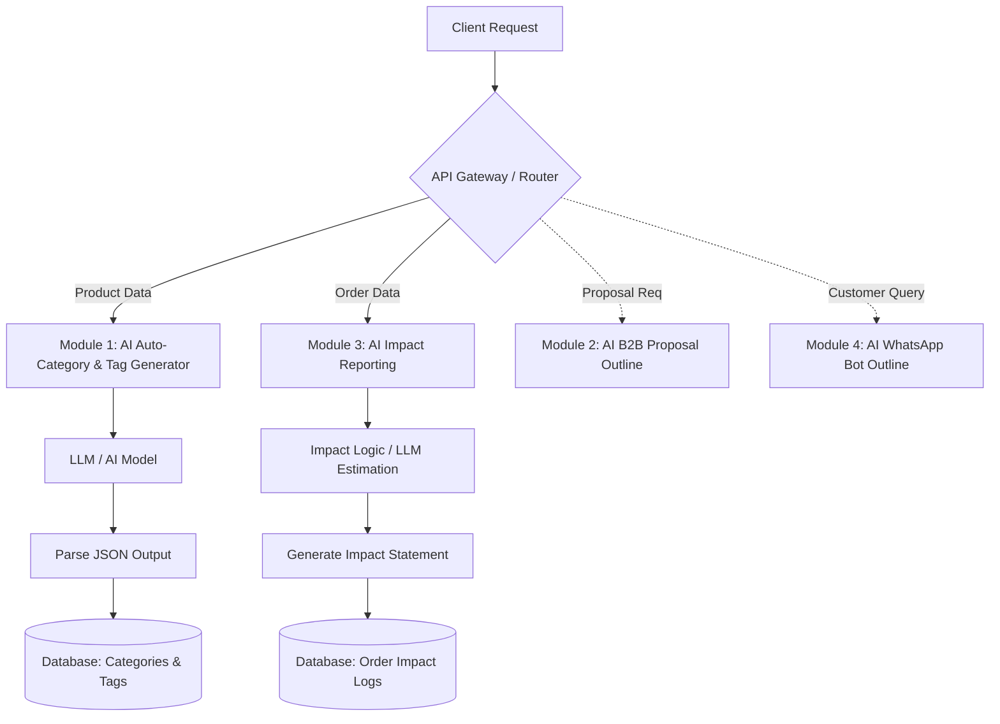

# Rayeva – AI Systems Assignment

## Role: Full Stack / AI Intern
Focus: Applied AI for Sustainable Commerce

---

## Project Architecture & Workflow Diagram

```mermaid
graph TD
    A[Client Request] --> B{API Gateway / Router}
    
    %% Module 1 Implemented
    B -->|Product Data| C[Module 1: AI Auto-Category & Tag Generator]
    C --> C1[LLM / AI Model]
    C1 --> C2[Parse JSON Output]
    C2 --> C3[(Database: Categories & Tags)]
    
    %% Module 3 Implemented
    B -->|Order Data| D[Module 3: AI Impact Reporting]
    D --> D1[Impact Logic / LLM Estimation]
    D1 --> D2[Generate Impact Statement]
    D2 --> D3[(Database: Order Impact Logs)]
    
    %% Architecture Outlines
    B -.->|Proposal Req| E[Module 2: AI B2B Proposal Outline]
    B -.->|Customer Query| F[Module 4: AI WhatsApp Bot Outline]
```

